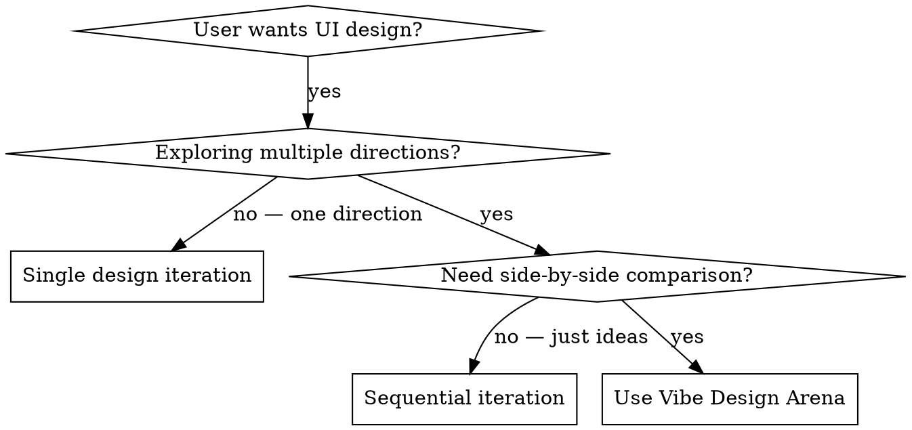

# Vibe Design Arena

Simultaneously explore and build three distinct frontend design styles for a product using `git worktree` for filesystem isolation and parallel sub-agents for concurrent construction. The user compares three complete, working prototypes and selects the winner.

**Core principle:** Design exploration should be parallel, not sequential. Three independent worktrees + three sub-agents = three complete prototypes in the time of one.

**REQUIRED BACKGROUND:** You MUST understand `using-git-worktrees` for worktree creation and isolation. **REFERENCE:** `dispatching-parallel-agents` for sub-agent dispatch patterns. **REFERENCE:** `impeccable` for frontend design quality standards.

---

## Decision Flowchart



**Use when:**
- User says "show me different design options", "compare UI styles", "build multiple versions"
- User wants to explore design directions before committing to one
- User asks for "design alternatives" or "visual exploration"
- Product has 1-3 core pages, static HTML/CSS is viable

**Don't use when:**
- User already has a clear design direction and just needs implementation
- Project requires complex backend integration (this skill is frontend-focused)
- User needs a single polished design, not exploration
- More than 3 core pages needed (scope too large for parallel prototyping)

---

## Architecture

```
                     Main Repo (product skeleton)
                         │
          ┌──────────────┼──────────────┐
          │              │              │
     worktree A      worktree B      worktree C
    (Style One)     (Style Two)     (Style Three)
          │              │              │
     sub-agent 1    sub-agent 2    sub-agent 3
    (parallel)      (parallel)      (parallel)
          │              │              │
          └──────────────┼──────────────┘
                         │
              User previews & selects
                  winning design
```

Three worktrees share one `.git` history. Each sub-agent works in its own isolated filesystem. Failures in one worktree never contaminate the others.

---

## Workflow

### Phase 1: Requirements Gathering

Collect these from the user in ONE structured prompt (don't interrupt repeatedly):

1. **Product type**: Web app / Mobile H5 / Desktop / Mini-program?
2. **Product summary**: What does it do? (one sentence)
3. **Core pages**: Which 1-3 pages to design? (e.g., homepage, detail page, settings)
4. **Target audience**: Who uses this? (influences style direction)
5. **Tech stack preference** (optional): React / Vue / Plain HTML+CSS / No preference?
6. **Brand info** (optional): Existing brand colors, logo, tone?

Default tech stack: **Plain HTML + CSS + vanilla JS** (zero dependencies, open in browser instantly).

### Phase 2: Style Research & Proposal

Based on the product info, research and draft three **radically different** design style proposals.

Each proposal must specify:

| Dimension | Description | Example |
|-----------|-------------|---------|
| **Style name** | A memorable, descriptive name | "Swiss Minimalism" |
| **Design philosophy** | One-sentence core idea | "Less is more, content is king" |
| **Color palette** | Primary + secondary + background (hex values) | `#1a1a2e` `#e94560` `#f5f5f5` |
| **Typography** | Font choices + size hierarchy | System sans-serif / heading 32px |
| **Component style** | Border-radius, shadows, spacing tendency | 12px radius + soft shadows |
| **Layout tendency** | Card-based / full-screen / split-panel | Card grid layout |
| **Best for** | What product type this suits | SaaS dashboard, content platform |
| **Reference** | 1-2 real-world product references | Linear, Notion, Apple |

Three default directions (adapt based on product type):

- **Style A**: Professional & restrained — high density, clear hierarchy, efficiency tools
- **Style B**: Playful & creative — bold colors, dynamic layout, consumer products
- **Style C**: Minimal & elegant — generous whitespace, refined typography, brand showcase

For detailed style parameters, load `reference/design-styles-catalog.md`. For curated palettes, load `reference/color-palettes.md`. For font pairings, load `reference/typography-pairings.md`.

**Design quality guard:** After drafting the three proposals but BEFORE presenting them to the user, load `impeccable` and audit each proposal against production design standards — check contrast ratios, typography hierarchy, color strategy, and layout coherence. Fix any issues before the user sees the proposals.

**STOP and wait for user feedback after presenting proposals.** User may adjust directions before you proceed.

### Phase 3: Parallel Build (Core)

#### Step 1: Initialize

Run the automation script:

```bash
bash scripts/create-arena.sh <project-name> <style-a-slug> <style-b-slug> <style-c-slug>
```

This script:
- Creates the project directory and initializes git
- Creates a skeleton `index.html` with semantic structure (shared across all styles)
- Commits the skeleton as the common ancestor (`base` commit)
- Creates 3 git worktrees, each on its own branch
- Validates all worktrees are ready

Directory result:

```
<project-name>/          ← main worktree (skeleton only)
<project>-style-a/       ← worktree A, branch style-a
<project>-style-b/       ← worktree B, branch style-b
<project>-style-c/       ← worktree C, branch style-c
    ↑ all three share <project-name>/.git/
```

#### Step 2: Dispatch Sub-Agents

Dispatch three sub-agents **in parallel** (all in one response). Use the template in `reference/subagent-prompt-template.md` — fill in the placeholders for each style's worktree path and design specifications.

Each sub-agent must:
1. Enter its assigned worktree directory
2. Build the full HTML/CSS/JS for the assigned style
3. Implement all requested core pages
4. Ensure pages open directly in a browser (static files)
5. Run `git add . && git commit -m "style: [style name] — complete implementation"`

Sub-agents are naturally isolated by worktree — their file changes never collide.

#### Step 3: Verify

After all three complete, confirm each worktree has its commit:

```bash
git -C ../<project>-style-a log --oneline
git -C ../<project>-style-b log --oneline
git -C ../<project>-style-c log --oneline
```

Commit graph:

```
base (skeleton)
  │
  ├── style-a (complete)
  ├── style-b (complete)
  └── style-c (complete)
```

### Phase 4: Preview & Review

Run the preview script to launch a side-by-side comparison:

```bash
bash scripts/preview-arena.sh <project-name>
```

This generates an HTML comparison page with all three versions loaded in iframes side-by-side and starts a local server. Direct the user to open the printed URL in their browser.

Present the user with comparison dimensions:
- Visual appeal
- Information readability
- Ease of use
- Brand fit
- Implementation quality

**Wait for user decision.** They may select one, mix elements from multiple, or request modifications to a specific version.

### Phase 5: Cleanup

After the user selects a winner, run:

```bash
bash scripts/cleanup-arena.sh <project-name> <selected-style>
```

This script:
- Merges the selected style branch into main
- Removes unused worktrees
- Keeps all branches in git history for future reference

### After Selection: Production Implementation

The selected design is now a prototype on the main branch. Decide the next step:

- **Transition to Comet**: If this design is destined for production, initiate a Comet change workflow. The winning style serves as the design direction — Comet's `open → design → build → verify → archive` pipeline will take it from prototype to shipped feature. Run `/comet` and reference the selected style's branch as the design spec.
- **Quick polish**: If the prototype needs only minor refinements, iterate directly in the main worktree. The other style branches remain available for reference.
- **Preserve exploration history**: All style branches stay in git history. Reference them later with `git log --oneline <style-a> <style-b> <style-c>`.

---

## Design Quality Standards

### Style Differentiation Guarantee

Three styles must differ across ALL of these dimensions (not just "different color"):

- ✅ **Layout structure**: Sidebar vs top nav vs bottom tab bar vs full-screen
- ✅ **Interaction pattern**: Modal vs inline expand vs page navigation
- ✅ **Visual language**: Flat vs gradient vs neumorphic vs glassmorphism
- ✅ **Information architecture**: Progressive disclosure vs dashboard panorama

### Tech Stack Adaptation

| User choice | Build approach |
|-------------|---------------|
| Plain HTML+CSS (default) | Static files, open in browser directly |
| React | `create-react-app` or Vite, component-based |
| Vue | `vue create` or Vite, SFC components |

For framework-based builds, run `npm install` inside each worktree.

### Color & Typography

- Use OKLCH for new projects; match existing tokens if project has them
- Body text contrast ≥ 4.5:1 against background
- Cap body line length at 65-75ch
- Pair fonts on contrast axes (serif + sans, geometric + humanist) — don't pair similar fonts
- Use `text-wrap: balance` on headings; `text-wrap: pretty` on body text

---

## Quick Reference

| Situation | Action |
|-----------|--------|
| User wants design exploration | Trigger this skill |
| User already has clear direction | Don't use — just build it |
| Need to initialize project | `bash scripts/create-arena.sh` |
| Need side-by-side preview | `bash scripts/preview-arena.sh` |
| User selected a winner | `bash scripts/cleanup-arena.sh` |
| One sub-agent fails | Remove its worktree, recreate, retry |
| User wants to modify one style | Edit in its worktree, commit — others untouched |
| User wants dark mode variant | Modify in the specific worktree, recommit |
| Framework-based build needed | `npm install` inside each worktree after creation |
| Need style inspiration | Load `reference/design-styles-catalog.md` |
| Need color palettes | Load `reference/color-palettes.md` |
| Need font pairings | Load `reference/typography-pairings.md` |
| Dispatching sub-agents | Use template in `reference/subagent-prompt-template.md` |

---

## Common Mistakes

### Superficial differentiation

- **Problem:** Three styles that differ only in color — user sees "the same design with different paint"
- **Fix:** Enforce differentiation across layout, interaction, visual language, AND information architecture. If two styles share the same layout skeleton, one must change.

### Skipping user confirmation

- **Problem:** Proceeding from proposal to build without user approval on style directions
- **Fix:** Phase 2 ends with an explicit STOP. Do not create worktrees until the user confirms the three proposals.

### Building sequentially

- **Problem:** Building style A → B → C one at a time, losing the parallelism benefit
- **Fix:** Dispatch all three sub-agents in ONE response. They run concurrently.

### Wrong worktree target

- **Problem:** Sub-agent edits files in the wrong worktree or the main worktree
- **Fix:** Each sub-agent's prompt must explicitly state its worktree path. Verify with `git worktree list` before dispatch.

### Not verifying commits

- **Problem:** Assuming sub-agents committed their work without checking
- **Fix:** Always run `git log --oneline` in each worktree after sub-agents return. Missing commits → sub-agent failed silently.

### Premature merge

- **Problem:** Merging before the user has seen and selected a winner
- **Fix:** Phase 4 must complete (user viewed preview, explicitly chose) before Phase 5 (merge).

---

## Red Flags

**Never:**
- Create worktrees before user confirms the three style proposals
- Dispatch sub-agents without specifying their exact worktree path
- Merge a style branch before user explicitly selects it
- Edit files in the main worktree during Phase 3 (it stays as skeleton)
- Skip the differentiation check — "different color" is not enough
- Proceed past Phase 2 without user sign-off on proposals

**Always:**
- Collect all requirements in one structured prompt (Phase 1)
- Present all three proposals with complete dimension tables (Phase 2)
- Dispatch all three sub-agents in one response for true parallelism
- Verify each worktree has a commit after sub-agents complete
- Run the preview script for side-by-side comparison
- Wait for explicit user selection before merging

---

## Troubleshooting

| Symptom | Likely Cause | Action |
|---------|-------------|--------|
| `create-arena.sh` fails: "already exists" | Project directory from a previous run | Remove or rename the old directory, or use a different project name |
| `git worktree add` fails: permission error | Sandbox or filesystem blocking worktree creation | Tell the user the sandbox blocked worktree creation; work in the current directory instead |
| Sub-agent returns with no commit | Agent completed but forgot to commit, or encountered an error | Check worktree status: `git -C <worktree> status`. If uncommitted files exist, commit them. If empty, re-dispatch the sub-agent |
| `preview-arena.sh`: "port 8899 in use" | Another process on that port | Kill the existing process or edit `PORT=8899` in the script to an unused port |
| Sub-agent produces near-identical styles | Prompt didn't enforce differentiation | Re-dispatch with explicit category constraints. Load `reference/design-styles-catalog.md` and pick styles from DIFFERENT categories |
| `cleanup-arena.sh` can't find worktree | Branch name mismatch or worktree already removed | Run `git worktree list` and `git branch --list` to verify state; pass the correct branch name |
| Preview iframes show blank pages | Browser blocks `file://` iframes (CORS) | Use the HTTP server mode (script defaults to this) — do NOT open the comparison HTML directly |
| Worktree left in detached HEAD | Sub-agent checked out a commit instead of staying on branch | `git -C <worktree> switch <branch-name>` to reattach, then commit any pending changes |

---

## Real-World Example

**Scenario:** Building a landing page for "MetricFlow," a SaaS analytics tool. Target audience: data analysts and engineering managers.

**Phase 1 — Requirements (one prompt):**
- Product: Web app landing page + dashboard preview
- Pages: Hero/landing, feature showcase, sample dashboard
- Audience: Data analysts (detail-oriented) + engineering managers (big-picture)

**Phase 2 — Three proposals drafted and impeccable-audited:**
1. **Swiss Data** (Swiss International): Clean grids, data tables as design elements, Inter, monochrome + signal blue
2. **Warm Analytics** (Organic/Biophilic): Earth tones, curved sections, Fraunces headings, data as organic shapes
3. **Terminal Pro** (Dark Mode Professional): Dark bg, monospace accents, terminal-style code blocks, neon green highlights

**Phase 3 — Parallel dispatch (one response, three agents):**
```
Agent 1 → Swiss Data       at ../metricflow-swiss-data      (4 min)
Agent 2 → Warm Analytics   at ../metricflow-warm-analytics   (3.5 min)
Agent 3 → Terminal Pro     at ../metricflow-terminal-pro     (5 min)
```
Each produced 3 HTML files + shared CSS. All three committed and verified.

**Phase 4 — Side-by-side preview.** User chose "Swiss Data" as primary, requested terminal-styled code blocks from "Terminal Pro" be merged in.

**Phase 5 — Merged `swiss-data`. Cherry-picked terminal code blocks from `terminal-pro`. Removed unused worktrees.**

**Result:** Three complete, distinct prototypes built and compared in ~15 minutes total. User selected a winner with concrete, informed preference — not guessing.

---

## Common Interaction Patterns

### Pattern 1: User gives a direction

```
User: "Design three styles for my expense tracker app. I like minimalism."
→ Propose three styles WITHIN the minimalist spectrum:
  A = Japanese wabi-sabi minimalism, B = Swiss International minimalism, C = Nordic warm minimalism
```

### Pattern 2: User wants to see references first

```
User: "Show me what similar products look like before proposing."
→ Research competitor designs first, then draft three directions informed by the research.
```

### Pattern 3: Iterative modification

```
User: "Style C is great, but switch it to dark mode."
→ Edit in worktree C (style-c branch), modify colors, commit. Other worktrees untouched.
```

### Pattern 4: Mix and match

```
User: "I like A's layout, B's color scheme, and C's typography."
→ Merge style A. Then cherry-pick color from B and fonts from C as follow-up commits.
```

---

## File Structure

```
vibe-design-arena/
  SKILL.md                           # This file — workflow orchestration + design standards
  scripts/
    create-arena.sh                  # Initialize git repo + skeleton + 3 worktrees
    cleanup-arena.sh                 # Merge winner + remove unused worktrees
    preview-arena.sh                 # Generate comparison page + start local server
  reference/
    design-styles-catalog.md         # 12+ design styles with full parameter specs
    color-palettes.md                # Curated palettes by mood and industry
    typography-pairings.md           # Font pairing recommendations
    subagent-prompt-template.md      # Standardized sub-agent dispatch template
```
